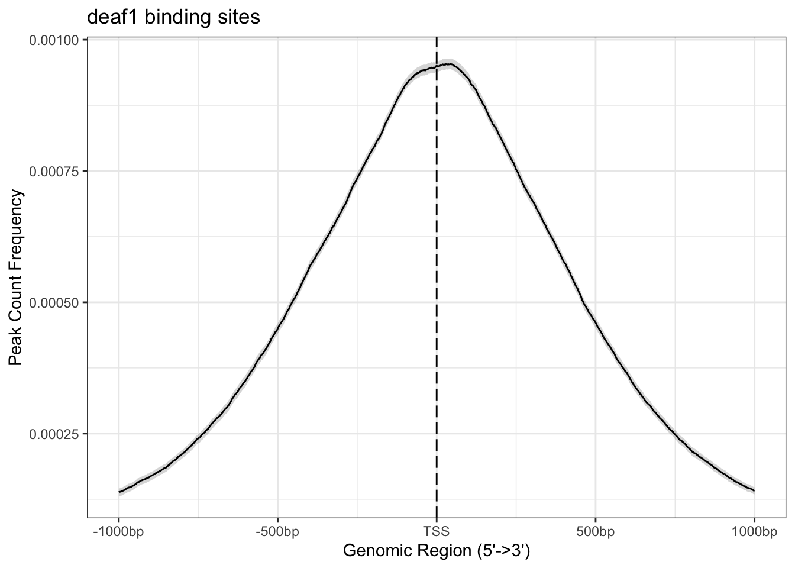
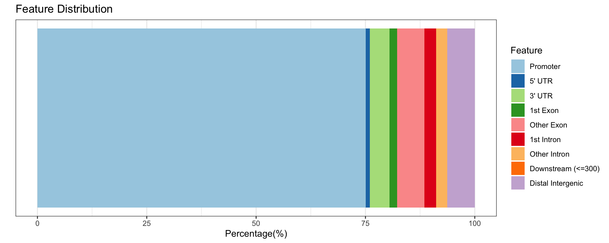
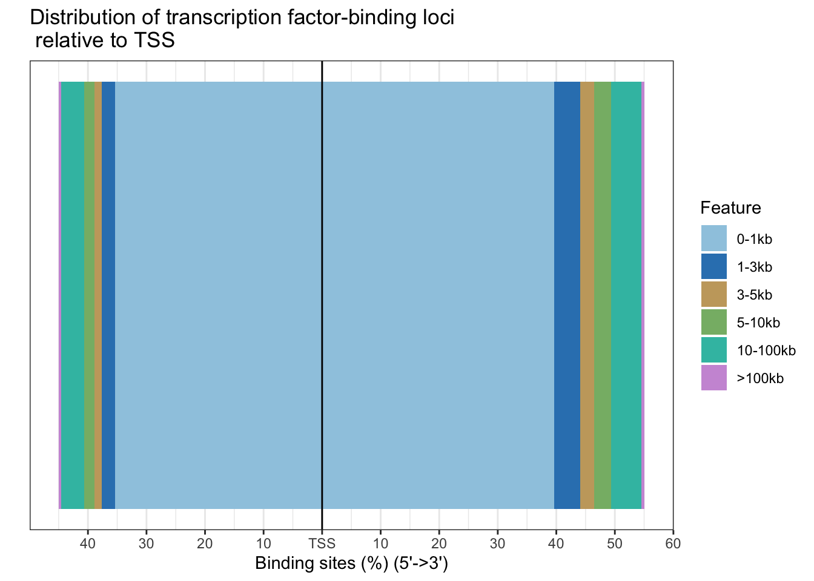

# Annotation of deaf1 ChIP-seq data


::: {.cell}

```{.r .cell-code}
suppressPackageStartupMessages({
    # Load libraries
    library(dplyr)
    library(ggplot2)
    library(Matrix)
    library(ChIPseeker)
    library(TxDb.Mmusculus.UCSC.mm10.knownGene)
    library(EnsDb.Mmusculus.v79)
    library(AnnotationDbi)
    library(org.Mm.eg.db)
})  
```

::: {.cell-output .cell-output-stderr}
```
Warning: package 'GenomicFeatures' was built under R version 4.3.3
```
:::

::: {.cell-output .cell-output-stderr}
```
Warning: package 'S4Vectors' was built under R version 4.3.2
```
:::

::: {.cell-output .cell-output-stderr}
```
Warning: package 'GenomeInfoDb' was built under R version 4.3.3
```
:::
:::

::: {.cell}

```{.r .cell-code}
library(biomaRt)
```

::: {.cell-output .cell-output-stderr}
```
Warning: package 'biomaRt' was built under R version 4.3.2
```
:::

```{.r .cell-code}
library(GenomicRanges)
library(Biostrings)
```

::: {.cell-output .cell-output-stderr}
```
Warning: package 'Biostrings' was built under R version 4.3.3
```
:::

::: {.cell-output .cell-output-stderr}
```
Loading required package: XVector
```
:::

::: {.cell-output .cell-output-stderr}
```

Attaching package: 'Biostrings'
```
:::

::: {.cell-output .cell-output-stderr}
```
The following object is masked from 'package:base':

    strsplit
```
:::

```{.r .cell-code}
library(GenomicFeatures)
library(org.Mm.eg.db)

mm.gtf.db <- makeTxDbFromGFF("~/Downloads/Mus_musculus.GRCm38.102.chr.gtf", format="gtf" )
```

::: {.cell-output .cell-output-stderr}
```
Import genomic features from the file as a GRanges object ...
```
:::

::: {.cell-output .cell-output-stderr}
```
OK
```
:::

::: {.cell-output .cell-output-stderr}
```
Prepare the 'metadata' data frame ... OK
Make the TxDb object ... 
```
:::

::: {.cell-output .cell-output-stderr}
```
Warning in .get_cds_IDX(mcols0$type, mcols0$phase): The "phase" metadata column contains non-NA values for features of type
  stop_codon. This information was ignored.
```
:::

::: {.cell-output .cell-output-stderr}
```
OK
```
:::

```{.r .cell-code}
#ensembl.genes = genes(mm.gtf.db)
ensembl.tx = transcripts(mm.gtf.db)
# Use version 102 (which fits our gtf file)

mouse = useEnsembl(biomart="ENSEMBL_MART_ENSEMBL", 
                   dataset="mmusculus_gene_ensembl", 
                  version = 102)

bm.annotations = getBM(attributes=c("ensembl_gene_id", "entrezgene_id", 
                                    "gene_biotype", "external_gene_name",
                                   "ensembl_transcript_id"),
                       mart=mouse, 
                       filters="ensembl_transcript_id", 
                       values=ensembl.tx$tx_name, uniqueRows=TRUE
                      )

ensembl.tx$gene_biotype = bm.annotations$gene_biotype[match(ensembl.tx$tx_name, bm.annotations$ensembl_transcript_id) ]
ensembl.tx$entrezgene_id = bm.annotations$entrezgene_id[match(ensembl.tx$tx_name, bm.annotations$ensembl_transcript_id) ]
ensembl.tx$external_gene_name = bm.annotations$external_gene_name[match(ensembl.tx$tx_name, bm.annotations$ensembl_transcript_id) ]
ensembl.tx$ensembl_transcript_id =  bm.annotations$ensembl_transcript_id[match(ensembl.tx$tx_name, bm.annotations$ensembl_transcript_id) ]
ensembl.tx$ensembl_gene_id <- bm.annotations$ensembl_gene_id[
    match(ensembl.tx$tx_name, bm.annotations$ensembl_transcript_id)
]

head(ensembl.tx)
```

::: {.cell-output .cell-output-stdout}
```
GRanges object with 6 ranges and 7 metadata columns:
      seqnames          ranges strand |     tx_id            tx_name
         <Rle>       <IRanges>  <Rle> | <integer>        <character>
  [1]     chr1 3073253-3074322      + |         1 ENSMUST00000193812
  [2]     chr1 3102016-3102125      + |         2 ENSMUST00000082908
  [3]     chr1 3252757-3253236      + |         3 ENSMUST00000192857
  [4]     chr1 3466587-3513553      + |         4 ENSMUST00000161581
  [5]     chr1 3531795-3532720      + |         5 ENSMUST00000192183
  [6]     chr1 3680155-3681788      + |         6 ENSMUST00000193244
              gene_biotype entrezgene_id external_gene_name
               <character>     <integer>        <character>
  [1]                  TEC          <NA>      4933401J01Rik
  [2]                snRNA          <NA>            Gm26206
  [3] processed_pseudogene          <NA>            Gm18956
  [4]            antisense          <NA>             Gm1992
  [5] processed_pseudogene          <NA>             Gm7341
  [6]                  TEC          <NA>            Gm10568
      ensembl_transcript_id    ensembl_gene_id
                <character>        <character>
  [1]    ENSMUST00000193812 ENSMUSG00000102693
  [2]    ENSMUST00000082908 ENSMUSG00000064842
  [3]    ENSMUST00000192857 ENSMUSG00000102851
  [4]    ENSMUST00000161581 ENSMUSG00000089699
  [5]    ENSMUST00000192183 ENSMUSG00000103147
  [6]    ENSMUST00000193244 ENSMUSG00000102348
  -------
  seqinfo: 22 sequences (1 circular) from an unspecified genome; no seqlengths
```
:::

```{.r .cell-code}
# save this as RDS so we don't have to keep running it
saveRDS(bm.annotations, file = "output/bm_annotations_tx.RDS")
saveRDS(ensembl.tx, file = "output/ensembl_tx.RDS")
```
:::

::: {.cell}

```{.r .cell-code}
library(rtracklayer)
library(BSgenome.Mmusculus.UCSC.mm10)
```

::: {.cell-output .cell-output-stderr}
```
Loading required package: BSgenome
```
:::

::: {.cell-output .cell-output-stderr}
```
Warning: package 'BSgenome' was built under R version 4.3.2
```
:::

::: {.cell-output .cell-output-stderr}
```
Loading required package: BiocIO
```
:::

::: {.cell-output .cell-output-stderr}
```

Attaching package: 'BiocIO'
```
:::

::: {.cell-output .cell-output-stderr}
```
The following object is masked from 'package:rtracklayer':

    FileForFormat
```
:::

```{.r .cell-code}
deaf1.idr = read.delim("../peaks/deaf1-idr", header=FALSE)
deaf1.filtered.idr = deaf1.idr[deaf1.idr[,5]>=540,] 
deaf1.filtered.idr = deaf1.filtered.idr[!deaf1.filtered.idr[,1] %in% c("chr4_GL456216_random", "chr4_JH584295_random"), ] 
 
deaf1.gr = GRanges(deaf1.filtered.idr[,1], IRanges(deaf1.filtered.idr[,2], deaf1.filtered.idr[,3]), idr= deaf1.filtered.idr[,5],
                 signalValue= deaf1.filtered.idr[,7])
names(deaf1.gr) = paste("peak", 1:length(deaf1.gr), sep=":")
```
:::

::: {.cell}

```{.r .cell-code}
txdb <- TxDb.Mmusculus.UCSC.mm10.knownGene
```
:::

::: {.cell}

```{.r .cell-code}
# Prepare the promoter regions
promoter <- getPromoters(TxDb = txdb, upstream = 1000, downstream=1000)
tagMatrixList <- getTagMatrix(deaf1.gr, windows = promoter)
```

::: {.cell-output .cell-output-stdout}
```
>> preparing start_site regions by gene... 2024-06-26 20:38:34
>> preparing tag matrix...  2024-06-26 20:38:34 
```
:::
:::

::: {.cell}

```{.r .cell-code}
plotAvgProf(tagMatrixList, xlim = c(-1000, 1000),  conf = 0.95,resample = 500, facet = "row") + labs(title = "deaf1 binding sites")
```

::: {.cell-output .cell-output-stdout}
```
>> plotting figure...			 2024-06-26 20:38:37 
>> Running bootstrapping for tag matrix...		 2024-06-26 20:39:18 
```
:::

::: {.cell-output-display}
{width=672}
:::
:::

::: {.cell}

```{.r .cell-code}
# Retrieve annotations
peakAnnoList <- annotatePeak(deaf1.gr, TxDb=txdb, 
                       tssRegion=c(-1000, 1000), verbose=TRUE)
```

::: {.cell-output .cell-output-stdout}
```
>> preparing features information...		 2024-06-26 20:39:20 
>> identifying nearest features...		 2024-06-26 20:39:20 
>> calculating distance from peak to TSS...	 2024-06-26 20:39:20 
>> assigning genomic annotation...		 2024-06-26 20:39:20 
>> assigning chromosome lengths			 2024-06-26 20:39:32 
>> done...					 2024-06-26 20:39:32 
```
:::
:::

::: {.cell}

```{.r .cell-code}
peakAnnoList
```

::: {.cell-output .cell-output-stdout}
```
Annotated peaks generated by ChIPseeker
16611/16611  peaks were annotated
Genomic Annotation Summary:
             Feature   Frequency
9           Promoter 75.07073626
4             5' UTR  0.90301607
3             3' UTR  4.49702005
1           1st Exon  1.73379086
7         Other Exon  6.27897177
2         1st Intron  2.66690747
8       Other Intron  2.51640479
6 Downstream (<=300)  0.06622118
5  Distal Intergenic  6.26693155
```
:::
:::

::: {.cell}

```{.r .cell-code}
plotAnnoBar(peakAnnoList)
```

::: {.cell-output-display}
{width=960}
:::
:::

::: {.cell}

```{.r .cell-code}
plotDistToTSS(peakAnnoList, 
              title="Distribution of transcription factor-binding loci \n relative to TSS")
```

::: {.cell-output-display}
{width=672}
:::
:::


## How many unique genes are bound by 608 peaks? 


::: {.cell}

```{.r .cell-code}
deaf1_annot <- data.frame(peakAnnoList)
head(deaf1_annot)
```

::: {.cell-output-display}
<div class="kable-table">

|seqnames |     start|       end| width|strand |  idr| signalValue|annotation | geneChr| geneStart|   geneEnd| geneLength| geneStrand|geneId    |transcriptId          | distanceToTSS|
|:--------|---------:|---------:|-----:|:------|----:|-----------:|:----------|-------:|---------:|---------:|----------:|----------:|:---------|:---------------------|-------------:|
|chr13    |  63562983|  63566276|  3294|*      | 1000|   106.63064|Promoter   |      13|  63508328|  63565735|      57408|          2|19206     |ENSMUST00000021921.10 |             0|
|chr11    |  51855313|  51858137|  2825|*      | 1000|   106.30658|Promoter   |      11|  51813455|  51857653|      44199|          2|76901     |ENSMUST00000020655.13 |             0|
|chr19    |  46500775|  46503213|  2439|*      | 1000|    91.29226|Promoter   |      19|  46501702|  46516848|      15147|          1|93679     |ENSMUST00000026008.8  |             0|
|chr10    |  95415519|  95417824|  2306|*      | 1000|    90.57410|Promoter   |      10|  95411490|  95416212|       4723|          2|216233    |ENSMUST00000170690.7  |             0|
|chr4     |  88031240|  88033829|  2590|*      | 1000|    89.50300|Promoter   |       4|  87769925|  88033364|     263440|          2|70122     |ENSMUST00000078090.11 |             0|
|chr8     | 120535539| 120539195|  3657|*      | 1000|    85.23701|Promoter   |       8| 120538696| 120538754|         59|          1|102466849 |ENSMUST00000184722.1  |             0|

</div>
:::
:::


Distribution of binding annotations: 

::: {.cell}

```{.r .cell-code}
deaf1_annot  %>% 
    group_by(annotation) %>% 
    summarize(n = n())  %>% 
    arrange(desc(n))  %>% 
    slice_head(n = 5)
```

::: {.cell-output-display}
<div class="kable-table">

|annotation                                           |     n|
|:----------------------------------------------------|-----:|
|Promoter                                             | 12470|
|Distal Intergenic                                    |  1041|
|3' UTR                                               |   747|
|5' UTR                                               |   150|
|Intron (ENSMUST00000127664.1/108148, intron 1 of 15) |    34|

</div>
:::
:::


First, we add the ensembl gene ID to the transcript ID: 


::: {.cell}

```{.r .cell-code}
deaf1_annot <- deaf1_annot %>% 
    tidyr::separate(transcriptId, 
             into = c("ens_transcript", sep = "."))
```
:::

::: {.cell}

```{.r .cell-code}
deaf1_annot$ens_genes <- ensembl.tx$ensembl_gene_id[
    match(deaf1_annot$ens_transcript, ensembl.tx$ensembl_transcript_id)]
    
deaf1_annot$gene_symbol <- ensembl.tx$external_gene_name[
    match(deaf1_annot$ens_transcript, ensembl.tx$ensembl_transcript_id)]
```
:::

::: {.cell}

```{.r .cell-code}
deaf1_annot$name = names(deaf1.gr)
```
:::

::: {.cell}

```{.r .cell-code}
# Check whether any genes are unmapped
sum(is.na(deaf1_annot$ens_genes))
```

::: {.cell-output .cell-output-stdout}
```
[1] 9
```
:::
:::


0 genes unmapped; all genes are mapped. 


::: {.cell}

```{.r .cell-code}
write.csv(deaf1_annot, file =  "output/deaf1_annot.csv")
write.csv(deaf1.idr, file =  "output/deaf1_idr.csv", quote=FALSE, row.names=F)
```
:::


How many unique genes? 


::: {.cell}

```{.r .cell-code}
length(unique(deaf1_annot$ens_genes))
```

::: {.cell-output .cell-output-stdout}
```
[1] 11546
```
:::
:::


# Summary


# sessionInfo()


::: {.cell}

```{.r .cell-code}
sessionInfo()
```

::: {.cell-output .cell-output-stdout}
```
R version 4.3.1 (2023-06-16)
Platform: aarch64-apple-darwin20 (64-bit)
Running under: macOS Sonoma 14.1

Matrix products: default
BLAS:   /Library/Frameworks/R.framework/Versions/4.3-arm64/Resources/lib/libRblas.0.dylib 
LAPACK: /Library/Frameworks/R.framework/Versions/4.3-arm64/Resources/lib/libRlapack.dylib;  LAPACK version 3.11.0

locale:
[1] en_US.UTF-8/en_US.UTF-8/en_US.UTF-8/C/en_US.UTF-8/en_US.UTF-8

time zone: Europe/London
tzcode source: internal

attached base packages:
[1] stats4    stats     graphics  grDevices utils     datasets  methods  
[8] base     

other attached packages:
 [1] BSgenome.Mmusculus.UCSC.mm10_1.4.3       
 [2] BSgenome_1.70.2                          
 [3] BiocIO_1.12.0                            
 [4] rtracklayer_1.62.0                       
 [5] Biostrings_2.70.3                        
 [6] XVector_0.42.0                           
 [7] biomaRt_2.58.2                           
 [8] org.Mm.eg.db_3.18.0                      
 [9] EnsDb.Mmusculus.v79_2.99.0               
[10] ensembldb_2.26.0                         
[11] AnnotationFilter_1.26.0                  
[12] TxDb.Mmusculus.UCSC.mm10.knownGene_3.10.0
[13] GenomicFeatures_1.54.4                   
[14] AnnotationDbi_1.64.1                     
[15] Biobase_2.62.0                           
[16] GenomicRanges_1.54.1                     
[17] GenomeInfoDb_1.38.8                      
[18] IRanges_2.36.0                           
[19] S4Vectors_0.40.2                         
[20] BiocGenerics_0.48.1                      
[21] ChIPseeker_1.38.0                        
[22] Matrix_1.6-5                             
[23] ggplot2_3.5.1                            
[24] dplyr_1.1.4                              

loaded via a namespace (and not attached):
  [1] splines_4.3.1                          
  [2] later_1.3.2                            
  [3] bitops_1.0-7                           
  [4] ggplotify_0.1.2                        
  [5] filelock_1.0.3                         
  [6] tibble_3.2.1                           
  [7] polyclip_1.10-6                        
  [8] XML_3.99-0.16.1                        
  [9] lifecycle_1.0.4                        
 [10] lattice_0.22-6                         
 [11] MASS_7.3-60.0.1                        
 [12] magrittr_2.0.3                         
 [13] rmarkdown_2.27                         
 [14] yaml_2.3.8                             
 [15] plotrix_3.8-4                          
 [16] httpuv_1.6.15                          
 [17] cowplot_1.1.3                          
 [18] DBI_1.2.3                              
 [19] RColorBrewer_1.1-3                     
 [20] abind_1.4-5                            
 [21] zlibbioc_1.48.2                        
 [22] purrr_1.0.2                            
 [23] ggraph_2.2.1                           
 [24] RCurl_1.98-1.14                        
 [25] yulab.utils_0.1.4                      
 [26] tweenr_2.0.3                           
 [27] rappdirs_0.3.3                         
 [28] GenomeInfoDbData_1.2.11                
 [29] enrichplot_1.22.0                      
 [30] ggrepel_0.9.5                          
 [31] tidytree_0.4.6                         
 [32] codetools_0.2-20                       
 [33] DelayedArray_0.28.0                    
 [34] DOSE_3.28.2                            
 [35] xml2_1.3.6                             
 [36] ggforce_0.4.2                          
 [37] tidyselect_1.2.1                       
 [38] aplot_0.2.2                            
 [39] farver_2.1.2                           
 [40] viridis_0.6.5                          
 [41] matrixStats_1.3.0                      
 [42] BiocFileCache_2.10.2                   
 [43] GenomicAlignments_1.38.2               
 [44] jsonlite_1.8.8                         
 [45] tidygraph_1.3.1                        
 [46] tools_4.3.1                            
 [47] progress_1.2.3                         
 [48] treeio_1.26.0                          
 [49] TxDb.Hsapiens.UCSC.hg19.knownGene_3.2.2
 [50] Rcpp_1.0.12                            
 [51] glue_1.7.0                             
 [52] gridExtra_2.3                          
 [53] SparseArray_1.2.4                      
 [54] xfun_0.45                              
 [55] qvalue_2.34.0                          
 [56] MatrixGenerics_1.14.0                  
 [57] withr_3.0.0                            
 [58] BiocManager_1.30.23                    
 [59] fastmap_1.2.0                          
 [60] boot_1.3-30                            
 [61] fansi_1.0.6                            
 [62] caTools_1.18.2                         
 [63] digest_0.6.35                          
 [64] R6_2.5.1                               
 [65] mime_0.12                              
 [66] gridGraphics_0.5-1                     
 [67] colorspace_2.1-0                       
 [68] GO.db_3.18.0                           
 [69] gtools_3.9.5                           
 [70] RSQLite_2.3.7                          
 [71] utf8_1.2.4                             
 [72] tidyr_1.3.1                            
 [73] generics_0.1.3                         
 [74] data.table_1.15.4                      
 [75] prettyunits_1.2.0                      
 [76] graphlayouts_1.1.1                     
 [77] httr_1.4.7                             
 [78] htmlwidgets_1.6.4                      
 [79] S4Arrays_1.2.1                         
 [80] scatterpie_0.2.2                       
 [81] pkgconfig_2.0.3                        
 [82] gtable_0.3.5                           
 [83] blob_1.2.4                             
 [84] shadowtext_0.1.3                       
 [85] htmltools_0.5.8.1                      
 [86] fgsea_1.28.0                           
 [87] ProtGenerics_1.34.0                    
 [88] scales_1.3.0                           
 [89] png_0.1-8                              
 [90] ggfun_0.1.5                            
 [91] knitr_1.47                             
 [92] rstudioapi_0.16.0                      
 [93] reshape2_1.4.4                         
 [94] rjson_0.2.21                           
 [95] nlme_3.1-164                           
 [96] curl_5.2.1                             
 [97] cachem_1.1.0                           
 [98] stringr_1.5.1                          
 [99] BiocVersion_3.18.1                     
[100] KernSmooth_2.23-24                     
[101] parallel_4.3.1                         
[102] HDO.db_0.99.1                          
[103] restfulr_0.0.15                        
[104] pillar_1.9.0                           
[105] grid_4.3.1                             
[106] vctrs_0.6.5                            
[107] gplots_3.1.3.1                         
[108] promises_1.3.0                         
[109] dbplyr_2.5.0                           
[110] xtable_1.8-4                           
[111] evaluate_0.24.0                        
[112] cli_3.6.2                              
[113] compiler_4.3.1                         
[114] Rsamtools_2.18.0                       
[115] rlang_1.1.4                            
[116] crayon_1.5.2                           
[117] labeling_0.4.3                         
[118] plyr_1.8.9                             
[119] fs_1.6.4                               
[120] stringi_1.8.4                          
[121] viridisLite_0.4.2                      
[122] BiocParallel_1.36.0                    
[123] munsell_0.5.1                          
[124] lazyeval_0.2.2                         
[125] GOSemSim_2.28.1                        
[126] hms_1.1.3                              
[127] patchwork_1.2.0                        
[128] bit64_4.0.5                            
[129] KEGGREST_1.42.0                        
[130] shiny_1.8.1.1                          
[131] SummarizedExperiment_1.32.0            
[132] interactiveDisplayBase_1.40.0          
[133] AnnotationHub_3.10.1                   
[134] igraph_2.0.3                           
[135] memoise_2.0.1                          
[136] ggtree_3.10.1                          
[137] fastmatch_1.1-4                        
[138] bit_4.0.5                              
[139] ape_5.8                                
```
:::
:::
