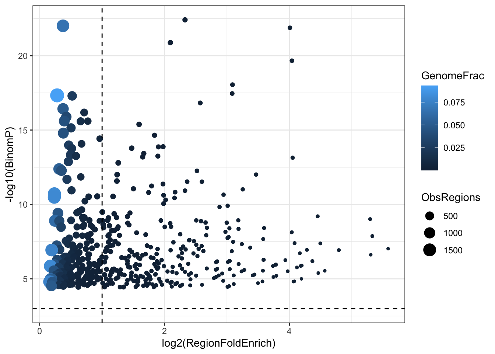

# GREAT analysis of deaf1 peaks 


::: {.cell}

```{.r .cell-code}
library("rGREAT")
```

::: {.cell-output .cell-output-stderr}
```
Loading required package: GenomicRanges
```
:::

::: {.cell-output .cell-output-stderr}
```
Loading required package: stats4
```
:::

::: {.cell-output .cell-output-stderr}
```
Loading required package: BiocGenerics
```
:::

::: {.cell-output .cell-output-stderr}
```

Attaching package: 'BiocGenerics'
```
:::

::: {.cell-output .cell-output-stderr}
```
The following objects are masked from 'package:stats':

    IQR, mad, sd, var, xtabs
```
:::

::: {.cell-output .cell-output-stderr}
```
The following objects are masked from 'package:base':

    anyDuplicated, aperm, append, as.data.frame, basename, cbind,
    colnames, dirname, do.call, duplicated, eval, evalq, Filter, Find,
    get, grep, grepl, intersect, is.unsorted, lapply, Map, mapply,
    match, mget, order, paste, pmax, pmax.int, pmin, pmin.int,
    Position, rank, rbind, Reduce, rownames, sapply, setdiff, sort,
    table, tapply, union, unique, unsplit, which.max, which.min
```
:::

::: {.cell-output .cell-output-stderr}
```
Loading required package: S4Vectors
```
:::

::: {.cell-output .cell-output-stderr}
```
Warning: package 'S4Vectors' was built under R version 4.3.2
```
:::

::: {.cell-output .cell-output-stderr}
```

Attaching package: 'S4Vectors'
```
:::

::: {.cell-output .cell-output-stderr}
```
The following object is masked from 'package:utils':

    findMatches
```
:::

::: {.cell-output .cell-output-stderr}
```
The following objects are masked from 'package:base':

    expand.grid, I, unname
```
:::

::: {.cell-output .cell-output-stderr}
```
Loading required package: IRanges
```
:::

::: {.cell-output .cell-output-stderr}
```
Loading required package: GenomeInfoDb
```
:::

::: {.cell-output .cell-output-stderr}
```
Warning: package 'GenomeInfoDb' was built under R version 4.3.3
```
:::

::: {.cell-output .cell-output-stderr}
```

```
:::

::: {.cell-output .cell-output-stderr}
```

```
:::

::: {.cell-output .cell-output-stderr}
```

------------------
Note: On Aug 19 2019 GREAT released version 4 where it supports `hg38`
genome and removes some ontologies such pathways. `submitGreatJob()`
still takes `hg19` as default. `hg38` can be specified by the `species
= 'hg38'` argument. To use the older versions such as 3.0.0, specify as
`submitGreatJob(..., version = '3.0.0')`.

From rGREAT version 1.99.0, it also implements the GREAT algorithm and
it allows to integrate GREAT analysis with the Bioconductor annotation
ecosystem. By default it supports more than 500 organisms. Check the
new function `great()` and the new vignette.
------------------
```
:::

```{.r .cell-code}
library(rtracklayer)
library(ggplot2)
library(GenomicRanges)

deaf1.idr = read.delim("../peaks/deaf1-idr", header=FALSE)
deaf1.filtered.idr = deaf1.idr[deaf1.idr[,5]>=540,] 

deaf1.gr = GRanges(deaf1.filtered.idr[,1], IRanges(deaf1.filtered.idr[,2]+1, deaf1.filtered.idr[,3]))
names(deaf1.gr) = paste("peak", 1:length(deaf1.gr), sep=":")
names(deaf1.gr) = paste("peak", 1:length(deaf1.gr), sep=":")
export.bed(deaf1.gr, "../peaks/deaf1_idr.bed")
```
:::

::: {.cell}

```{.r .cell-code}
great = read.delim("deaf1_greatExportAll.tsv", sep="\t", comment.char = "#", header=FALSE)

colnames(great) = c("Ontology", "ID", "Desc", "BinomRank", "BinomP", 
                    "BinomBonfP", "BinomFdrQ", "RegionFoldEnrich", 
                    "ExpRegions", "ObsRegions", "GenomeFrac", "SetCov",
                    "HyperRank", "HyperP", "HyperBonfP", "HyperFdrQ", 
                    "GeneFoldEnrich", "ExpGenes", "ObsGenes", "TotalGenes",
                    "GeneSetCov", "TermCov", "Regions", "Genes")


great.bp = great[great$Ontology == "GO Biological Process", ]
sum(great.bp$BinomFdrQ < 0.1)
```

::: {.cell-output .cell-output-stdout}
```
[1] 500
```
:::

```{.r .cell-code}
great.hgph = great[great$Ontology == "Human Phenotype", ]
sum(great.hgph$BinomFdrQ < 0.1)
```

::: {.cell-output .cell-output-stdout}
```
[1] 500
```
:::

```{.r .cell-code}
great.mmph = great[great$Ontology == "Mouse Phenotype", ]
sum(great.mmph$BinomFdrQ < 0.1)
```

::: {.cell-output .cell-output-stdout}
```
[1] 500
```
:::
:::

::: {.cell}

```{.r .cell-code}
ggplot(great.bp[great.bp$ObsRegions >=5, ], aes(x=log2(RegionFoldEnrich), y=-log10(BinomP), size=ObsRegions, colour=GenomeFrac )) + geom_point() + theme_bw() + geom_hline(yintercept=-log(0.05), linetype = "dashed") + geom_vline(xintercept = 1, linetype = "dashed") 
```

::: {.cell-output-display}
{width=672}
:::
:::

::: {.cell}

```{.r .cell-code}
sessionInfo()
```

::: {.cell-output .cell-output-stdout}
```
R version 4.3.1 (2023-06-16)
Platform: aarch64-apple-darwin20 (64-bit)
Running under: macOS Sonoma 14.1

Matrix products: default
BLAS:   /Library/Frameworks/R.framework/Versions/4.3-arm64/Resources/lib/libRblas.0.dylib 
LAPACK: /Library/Frameworks/R.framework/Versions/4.3-arm64/Resources/lib/libRlapack.dylib;  LAPACK version 3.11.0

locale:
[1] en_US.UTF-8/en_US.UTF-8/en_US.UTF-8/C/en_US.UTF-8/en_US.UTF-8

time zone: Europe/London
tzcode source: internal

attached base packages:
[1] stats4    stats     graphics  grDevices utils     datasets  methods  
[8] base     

other attached packages:
[1] ggplot2_3.5.1        rtracklayer_1.62.0   rGREAT_2.4.0        
[4] GenomicRanges_1.54.1 GenomeInfoDb_1.38.8  IRanges_2.36.0      
[7] S4Vectors_0.40.2     BiocGenerics_0.48.1 

loaded via a namespace (and not attached):
  [1] DBI_1.2.2                               
  [2] bitops_1.0-7                            
  [3] biomaRt_2.58.2                          
  [4] rlang_1.1.3                             
  [5] magrittr_2.0.3                          
  [6] GetoptLong_1.0.5                        
  [7] matrixStats_1.3.0                       
  [8] compiler_4.3.1                          
  [9] RSQLite_2.3.7                           
 [10] GenomicFeatures_1.54.4                  
 [11] png_0.1-8                               
 [12] vctrs_0.6.5                             
 [13] stringr_1.5.1                           
 [14] pkgconfig_2.0.3                         
 [15] shape_1.4.6.1                           
 [16] crayon_1.5.2                            
 [17] fastmap_1.2.0                           
 [18] dbplyr_2.5.0                            
 [19] XVector_0.42.0                          
 [20] labeling_0.4.3                          
 [21] utf8_1.2.4                              
 [22] Rsamtools_2.18.0                        
 [23] promises_1.3.0                          
 [24] rmarkdown_2.27                          
 [25] bit_4.0.5                               
 [26] xfun_0.44                               
 [27] zlibbioc_1.48.2                         
 [28] cachem_1.1.0                            
 [29] jsonlite_1.8.8                          
 [30] progress_1.2.3                          
 [31] blob_1.2.4                              
 [32] later_1.3.2                             
 [33] DelayedArray_0.28.0                     
 [34] BiocParallel_1.36.0                     
 [35] parallel_4.3.1                          
 [36] prettyunits_1.2.0                       
 [37] R6_2.5.1                                
 [38] stringi_1.8.4                           
 [39] RColorBrewer_1.1-3                      
 [40] Rcpp_1.0.12                             
 [41] SummarizedExperiment_1.32.0             
 [42] iterators_1.0.14                        
 [43] knitr_1.47                              
 [44] httpuv_1.6.15                           
 [45] Matrix_1.6-5                            
 [46] tidyselect_1.2.1                        
 [47] rstudioapi_0.16.0                       
 [48] abind_1.4-5                             
 [49] yaml_2.3.8                              
 [50] doParallel_1.0.17                       
 [51] codetools_0.2-20                        
 [52] curl_5.2.1                              
 [53] lattice_0.22-6                          
 [54] tibble_3.2.1                            
 [55] withr_3.0.0                             
 [56] Biobase_2.62.0                          
 [57] shiny_1.8.1.1                           
 [58] KEGGREST_1.42.0                         
 [59] evaluate_0.23                           
 [60] BiocFileCache_2.10.2                    
 [61] xml2_1.3.6                              
 [62] circlize_0.4.16                         
 [63] Biostrings_2.70.3                       
 [64] pillar_1.9.0                            
 [65] filelock_1.0.3                          
 [66] MatrixGenerics_1.14.0                   
 [67] TxDb.Hsapiens.UCSC.hg19.knownGene_3.2.2 
 [68] DT_0.33                                 
 [69] foreach_1.5.2                           
 [70] generics_0.1.3                          
 [71] RCurl_1.98-1.14                         
 [72] hms_1.1.3                               
 [73] munsell_0.5.1                           
 [74] scales_1.3.0                            
 [75] xtable_1.8-4                            
 [76] glue_1.7.0                              
 [77] tools_4.3.1                             
 [78] BiocIO_1.12.0                           
 [79] TxDb.Hsapiens.UCSC.hg38.knownGene_3.18.0
 [80] GenomicAlignments_1.38.2                
 [81] XML_3.99-0.16.1                         
 [82] grid_4.3.1                              
 [83] AnnotationDbi_1.64.1                    
 [84] colorspace_2.1-0                        
 [85] GenomeInfoDbData_1.2.11                 
 [86] restfulr_0.0.15                         
 [87] cli_3.6.2                               
 [88] rappdirs_0.3.3                          
 [89] fansi_1.0.6                             
 [90] S4Arrays_1.2.1                          
 [91] dplyr_1.1.4                             
 [92] gtable_0.3.5                            
 [93] digest_0.6.35                           
 [94] SparseArray_1.2.4                       
 [95] farver_2.1.2                            
 [96] org.Hs.eg.db_3.18.0                     
 [97] rjson_0.2.21                            
 [98] htmlwidgets_1.6.4                       
 [99] memoise_2.0.1                           
[100] htmltools_0.5.8.1                       
[101] lifecycle_1.0.4                         
[102] httr_1.4.7                              
[103] GlobalOptions_0.1.2                     
[104] GO.db_3.18.0                            
[105] mime_0.12                               
[106] bit64_4.0.5                             
```
:::
:::
